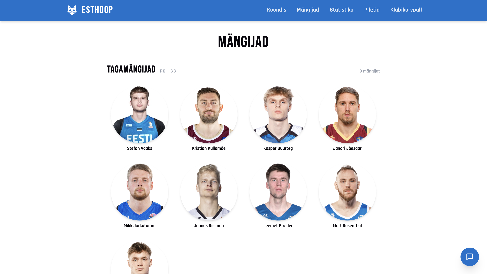
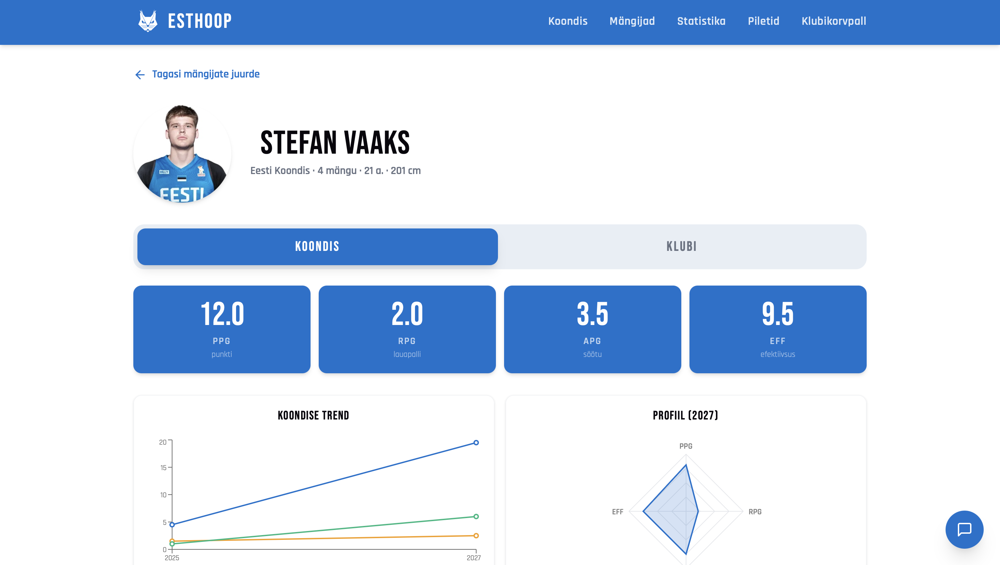
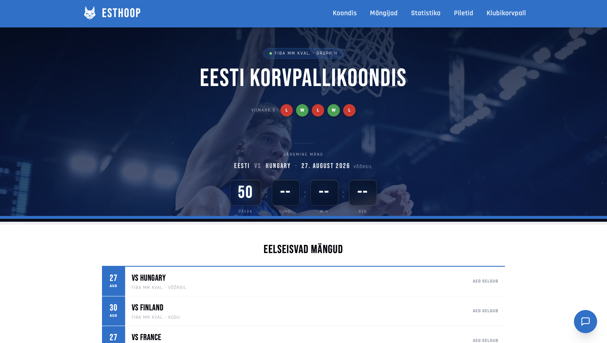
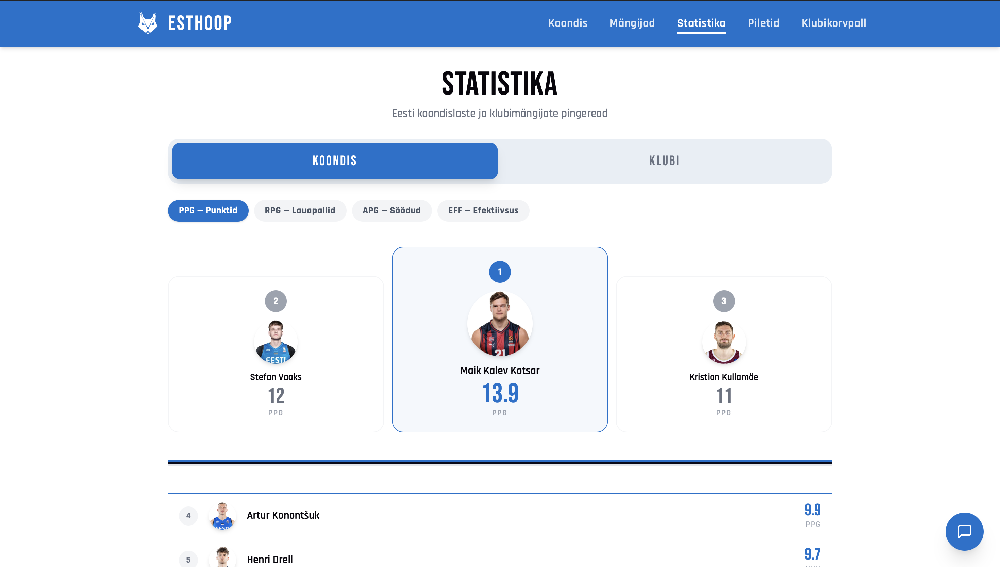
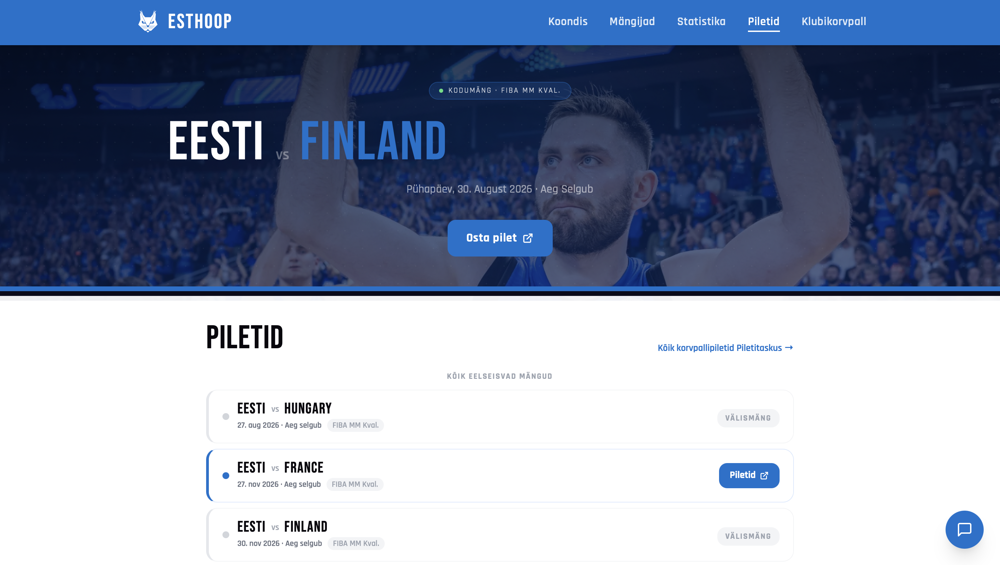

# EstHoop

Eesti korvpalli fännileht ([esthoop.ee](https://esthoop.ee)) — Eesti koondislaste ja
klubimängijate profiilid ja statistika, koondise mängud/tabeliseis, piletite leht ning AI
vestlusrobot.

## Ekraanipildid

| Mängijad | Mängija |
|---|---|
|  |  |

| Koondis | Statistika |
|---|---|
|  |  |

| Piletid |
|---|
|  |

## Funktsioonid

- **Mängijad** — profiilid, klubi- ja koondisestatistika (hooajad, mängud, graafikud)
- **Statistika** — Koondis/Klubi pingeread, filtreeritavad statistikanäitajate kaupa
- **Koondis** — eelseisvad mängud, viimased tulemused koos mänguskooridega, grupi tabeliseis
- **Klubikorvpall** — Eesti koondislaste klubimängud üle maailma (ProBallers)
- **Piletid** — koondise kodumängude info, link Piletitaskusse
- **Vestlusrobot** — Anthropic Claude põhine, vastab ainult saidi enda andmete põhjal

## Tehnoloogiad

**Frontend** — React 19, Vite, React Router v7, Tailwind CSS v4, Recharts (graafikud),
Framer Motion + tsParticles (Koondis hero animatsioon).

**Backend** — FastAPI + SQLAlchemy (Python), PostgreSQL, BeautifulSoup (ProBallers/FIBA
scraping), Anthropic API (vestlusrobot, `claude-haiku-4-5`).

**Hosting** — Frontend: [Vercel](https://vercel.com) (projekt `est-hoop`). Backend:
[Render](https://render.com) (`esthoop-backend`). Andmed värskendatakse ajastatud GitHub
Actions töövoogudega.

## Projekti struktuur

```
backend/
  main.py                 FastAPI rakendus, kõik API endpoint'id
  database.py             SQLAlchemy engine/sessioon (DATABASE_URL kaudu)
  models.py               ORM mudelid (Player, PlayerClubStats, PlayerFibaStats, NationalTeamCache)
  scraper.py               ProBallers + FIBA scraping-funktsioonid
  migrations/              Ühekordsed skriptid (01-13) + päevased refresh-jobid (08, 09, 10)
                           + check_new_competition.py (FIBA uue turniiri jälgimine)
  requirements.txt, vercel.json

frontend/
  src/
    pages/                 KoondisPage, PlayersPage, PlayerPage, StatsPage, PiletidPage, KlubiKorvpallPage
    components/             Navbar, PlayerAvatar, Panel, FlagDivider, StatsTabToggle, ChatWidget, Skeleton, PageLoader
    contexts/                LoadingContext
  public/
    players/                Mängijate profiilipildid ({slug}.jpg/png)
    Views/                   README ekraanipildid

.github/workflows/         Ajastatud (cron) andmete värskendamise töövood
```

## Käivitamine

```bash
# Backend
cd backend
python -m venv venv && source venv/bin/activate
pip install -r requirements.txt
# loo .env fail (vt allpool)
uvicorn main:app --reload   # http://localhost:8000

# Frontend
cd frontend
npm install
# loo .env fail (vt allpool)
npm run dev                  # http://localhost:5173
```

### Keskkonnamuutujad

**`backend/.env`**

| Muutuja | Kirjeldus |
|---|---|
| `DATABASE_URL` | Postgres ühendusstring |
| `ANTHROPIC_API_KEY` | Vestlusroboti jaoks (Anthropic API) |
| `TELEGRAM_BOT_TOKEN` / `TELEGRAM_CHAT_ID` | Valikuline — ainult `migrations/check_new_competition.py` teavituste jaoks |

**`frontend/.env`**

| Muutuja | Kirjeldus |
|---|---|
| `VITE_API_URL` | Backend'i URL (nt `http://localhost:8000` lokaalselt) |

## Andmebaas ja andmevoog

Live scraping toimub ainult ajastatud GitHub Actions töövoogudega (`.github/workflows/`),
mis täidavad Postgres cache-tabeleid — API endpoint'id loevad esmalt sealt, live scraping
on ainult kohapealne varulahendus (ProBallers/FIBA blokeerivad sageli Render'i IP-sid).

| Andmed | Allikas | Cache-tabel | Ajastus |
|---|---|---|---|
| Mängijate identiteet | Käsitsi kureeritud (proballers_id, fiba_id) | `Player` | Ühekordne migratsioon |
| Klubistatistika | proballers.com | `PlayerClubStats` | Iga päev 02:00 UTC |
| Koondisestatistika (mängija) | fiba.basketball (mängija leht) | `PlayerFibaStats` | Iga päev 21:00 UTC |
| Koondise mängud/tabel/mänguskoorid | fiba.basketball + digital-api.fiba.basketball | `NationalTeamCache` | Iga päev 21:00 UTC |

## Skriptid

**`backend/migrations/`** — numbrilised ühekordsed skriptid (01-13: mängijate
seemnestamine, ID-de lisamine, roster-muudatused) ning kolm neist (08, 09, 10) +
`check_new_competition.py` töötavad ka päevaste refresh-jobidena GitHub Actions kaudu.

| Käsk | Mida teeb |
|---|---|
| `npm run dev` | Käivita Vite dev-server |
| `npm run build` | Ehita production build |
| `npm run lint` | Käivita ESLint |
| `npm run preview` | Eelvaata production build'i lokaalselt |

## Deploy

Frontend deploybib automaatselt Vercel'isse (`est-hoop` projekt) `main` branchi
push'imisel. Backend jookseb Render'is (`esthoop-backend`) — deploy toimub samuti
git-integratsiooni kaudu. `/health` endpoint on UptimeRobot'iga jälgitav (aktsepteerib nii
GET- kui HEAD-päringuid).
